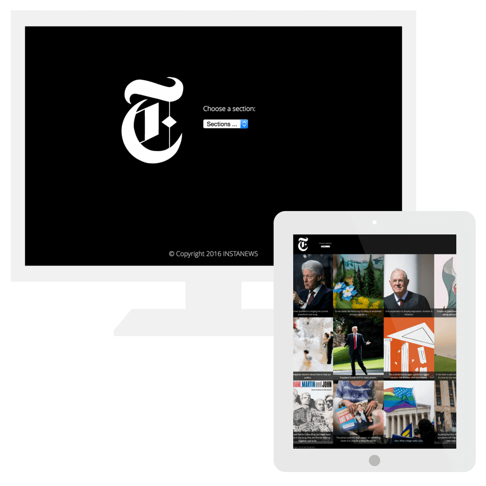
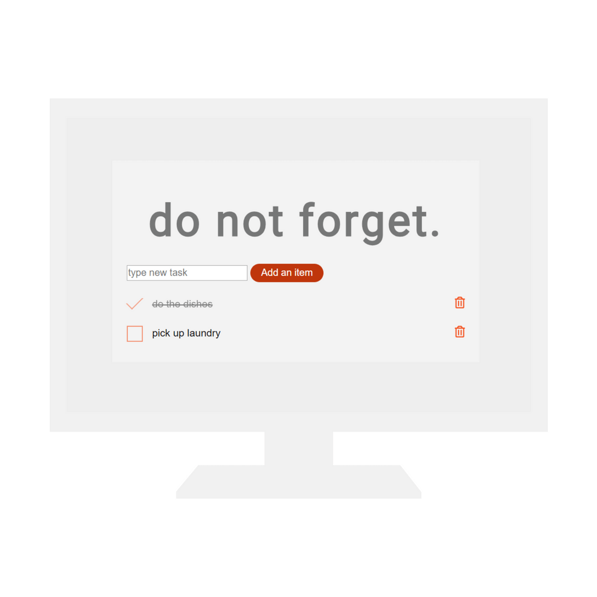
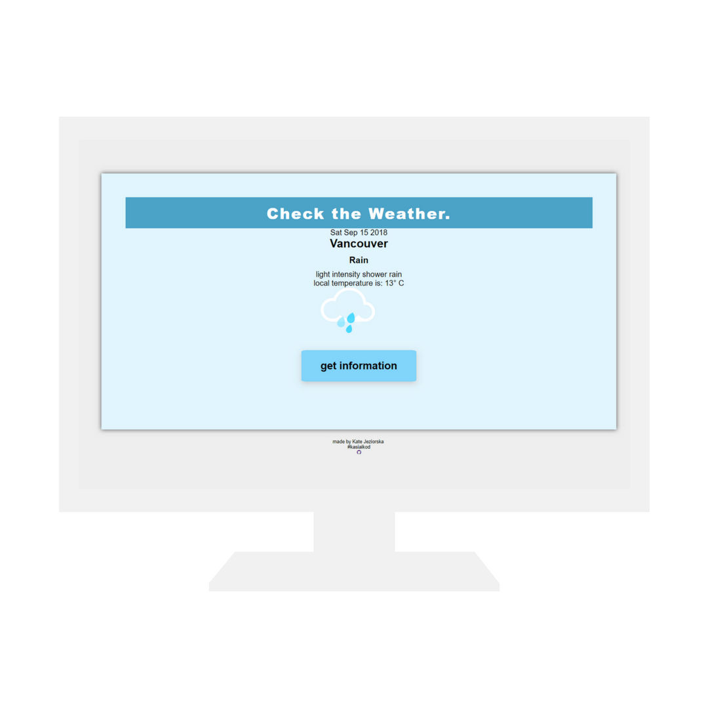
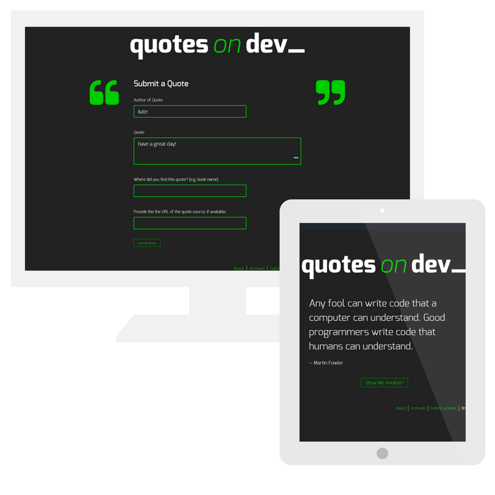
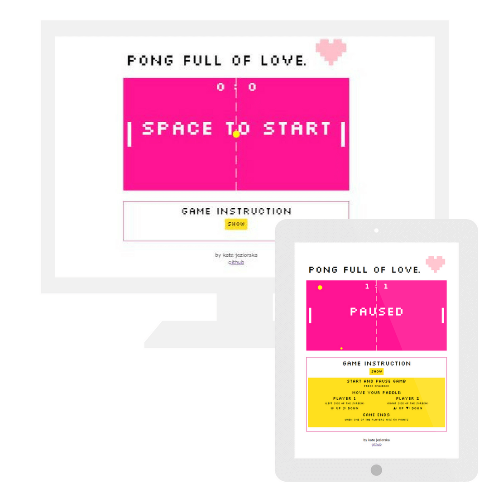
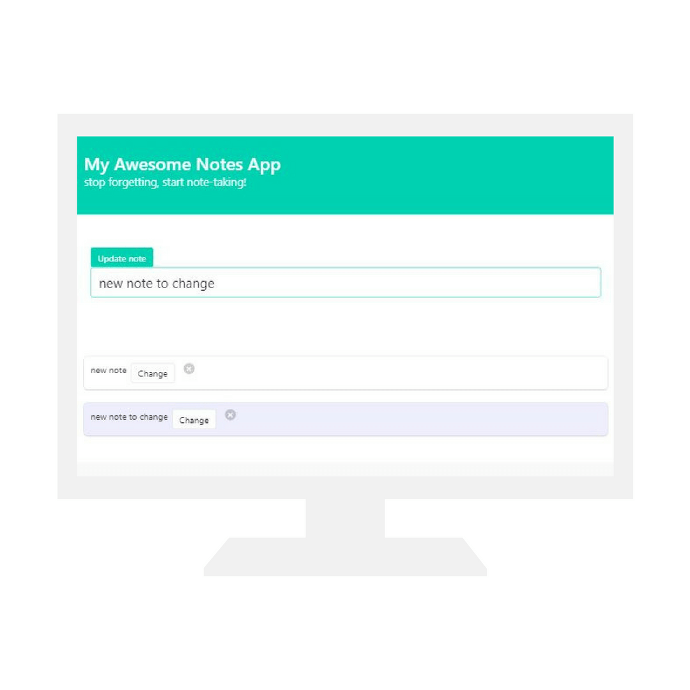

<!-- Main -->
<!-- Main -->

<!-- One -->
<section id="one">
	

		<header class="major">
			<h2>why am I coding?</h2>
		</header>
		
I write code to solve problems. Since my family moved to Canada the best way to keep the connections between people is technology. That's why in 2014 I started sharing our stories on wordpress.org. Soon it was not enough - I wanted to have a full control over my piece of the internet.  Some day, I will build an app to fully see, feel and touch people on the other side of the copmuter screen. Skype 2.0

	

</section>

<!-- Two -->
<section id="two" class="spotlights inner">
	<section class="website-item">
		
			
		
		

			

				<header class="major">
					<h3>Instastories app</h3>
				</header>
						
spring 2018.

						<ul>
						<li>fetching current articles from New Your Times</li>
						<li>AJAX request built with jquery</li>
                        </ul>
				<ul class="actions">
					<li><a href="#" class="button">demo</a></li>
				</ul>
			

		

	</section>
	<section class="website-item">
		
		

			

				<header class="major">
					<h3>TO DO list</h3>
				</header>
				
spring 2018.

					<ul>
						<li>very simple app built with jquery</li>
						<li>css styling based on material design</li>
					</ul>
				<ul class="actions">
					<li><a href="https://pinaska.github.io/to_do_app/" class="button">demo</a></li>
				</ul>
			

		

	</section>
	<section class="website-item">
		
		

			

				<header class="major">
					<h3>Weather app</h3>
				</header>
						
ongoing

                        <ul>
						<li>very simple app built with jquery</li>
						<li>showing current time and weather from Open Weather API</li>
                        <li>animated weather icons from codepen.io</li>
					</ul>
				<ul class="actions">
					<li><a href="https://pinaska.github.io/api_weather_app/" class="button">demo</a></li>
				</ul>
			

		

	</section>
	<section class="website-item">
		
		

			

				<header class="major">
					<h3>Quotes on Devs WordPress app</h3>
				</header>
                        
spring 2018

						
simple Wordpress based application using Wordpress REST API endpoint using Ajax to get and post custom posts..

				<ul class="actions">
					<li><a href="https://github.com/pinaska/quotes_on_dev_WP_app" class="button">check the code</a></li>
				</ul>
			

		

	</section>
	<section class="website-item">
		
		

			

				<header class="major">
					<h3>Pong game</h3>
				</header>
				
spring 2018.

				
ES6 JavaScript only classic pong game

				<ul class="actions">
					<li><a href="https://pinaska.github.io/pong-game_ES6_SVG_render_web_game/" class="button">demo</a></li>
				</ul>
			

		

	</section>
	<section class="website-item">
		
		

			

				<header class="major">
					<h3>Notes taking app</h3>
				</header>
				
spring 2018.

				<ul>
                <li>JavaScript only app, where user can add, delete and change notes</li>
                <li>used CSS framework: Bulma</li>
                <li>user story in progress: change the note color from 3 color palette</li>
                </ul>
				<ul class="actions">
					<li><a href="https://my-note-app.glitch.me/" class="button">demo</a></li>
				</ul>
			

		

	</section>
</section>

