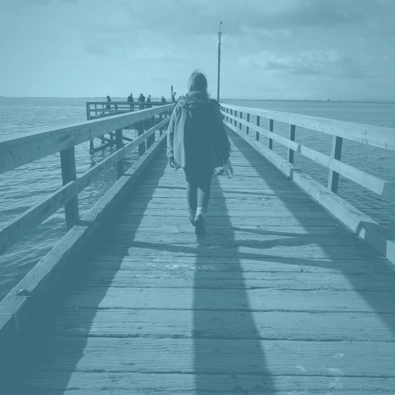
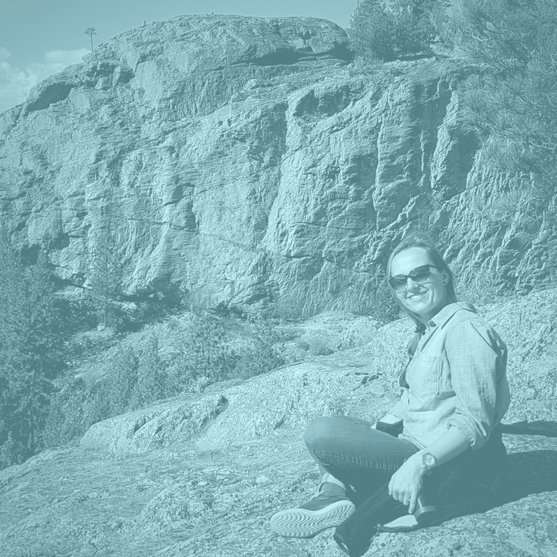
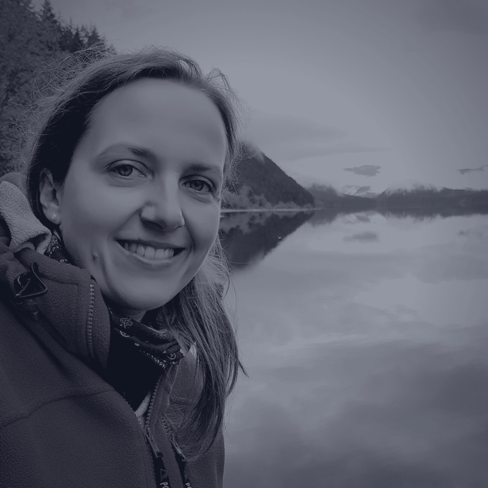
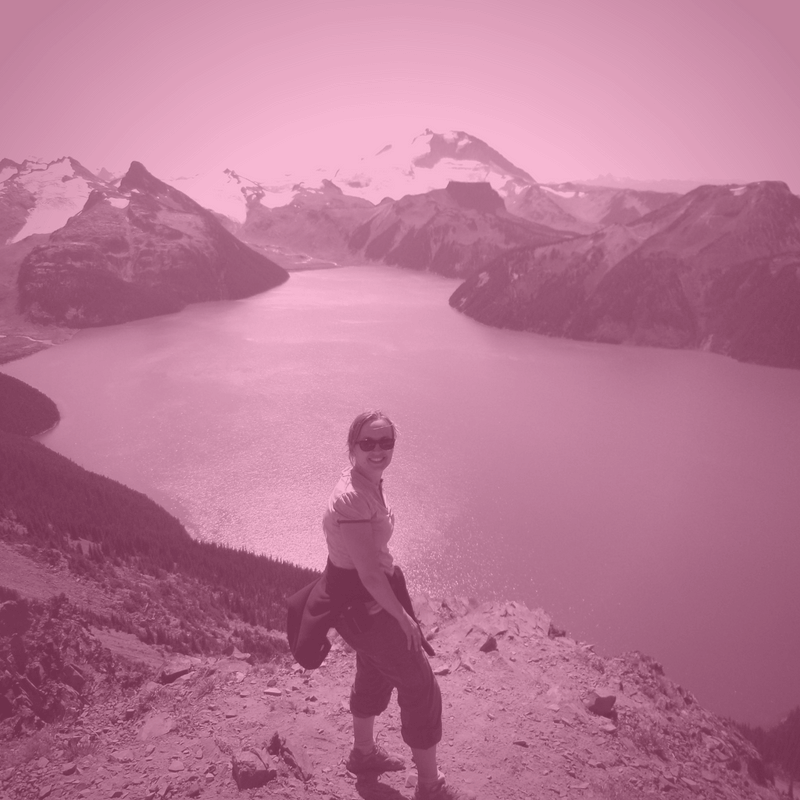

<!-- Main -->

<!-- One -->
<section id="one">
	

		<header class="major">
			<h1>A little about me</h1>
		</header>
<!-- Content -->
		<h2 id="content">hi, my name is  Kate and I am...</h2> 
		

			

				<h3>... an ordinary 30 something girl</h3>
				
My family never really planned to live in Canada. I never really thought I will be in constant awe with technology. It all happened and I am very happy about it.

			

			

				<h3>... a never-stop-learning web developer</h3>
				
I completed Web Developer Professional Program at RED Academy in Vancouver. Everyday I am learning more, using courses on lynda.com and pluralsight. 

			

			<!-- Break -->
			

			

				

				

				

				

			

		

		<!--Break-->
			

				<h3>... a project manager</h3>
				<pl>I have worked 5+ years in a finance, corporate enviroment in Poland and Canada, leading projects and analyzing numbers. My previous jobs and studies helped me grately to understand web. Seriously! I studied language and culture -  now I can apply my knowledge of human needs to web design! I am well organized with an eye for details. If you need a go-getter, I am your person.</pl>
			

			

				<h3>... a women community builder</h3>
				
Staring from November 2016 I have organized more than 20 meetings for women new to Vancouver. In 2017 I listened to 150+ women stories. Every month we meet, we chat, we grow. This is all possible thanks to Mount Pleasant Neighbourhood House and Vacnouver Foundation. And it all started becuse I wanted to support women in my community.

			

			

				<h3>... a blogger</h3>
				
I run two blogs on WordPress, both in Polish language (sorry!). One is about our family Canadian adventure, and the other is about my way to become a full stack programmer. I have been writing content, running social media, sending newsletters from 2014. This help me to understand that web project does not end, once launched - it needs to follow client strategy and generate leads. I know digital marketing well enough to help clients constantly grow audience.

			

		

	

</section>

